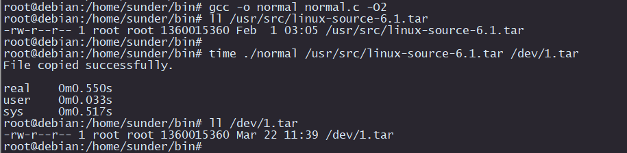
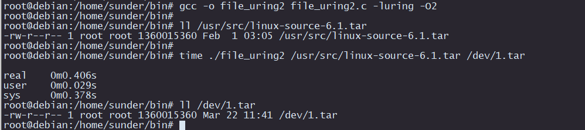

# io_uring(linux core 5.1+)
io_uring的几个例子，网上io_uring的介绍很多，这里不赘述了，这里给几个例子做一下对比，可以看看io_uring的强悍之处。

1. 文件io

这里给一个大文件拷贝的例子，normal.c是普通读写文件的例子，file_uring.c是读全部submit后再统一从ring中获取，效率会慢一些；file_uring2.c就是一边submit一边从ring中干获取，看下面的对比图：

这里是normal.c文件执行后的结果，1.35GB的文件大约是0.55s左右。

这里是file_uring2.c的执行结果，时间大约是0.4s左右，大文件IO的性能提升26%之多！反复测试平均值也在25%以上，可以说很给力了！（感觉效率还是file_uring_single.c那个最快，一条一条submit再消费，极致得快）

-------------------------------------------------------------
2. 网络IO

这里和之前epoll+socket的简易版web server(https://github.com/sunder3344/non-block-socket-server/tree/master/simple_web_server)做一个对比，socket_uring.c是基于io_uring的简易web server，压测使用siege，参数如下：

siege -c 1000 -t 1m http://****:8888/index.html

这里是epoll+socket的结果

这里是io_uring+socket的结果

可见看见io_uring在网络io上的提升并不明显，在我的虚拟机上甚至还不如epoll的表现，如果这里性能提升很明显，nginx，redis这类软件早就更换模型了。